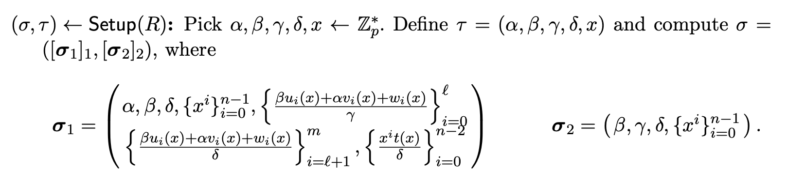
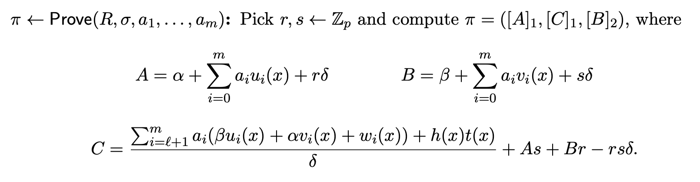
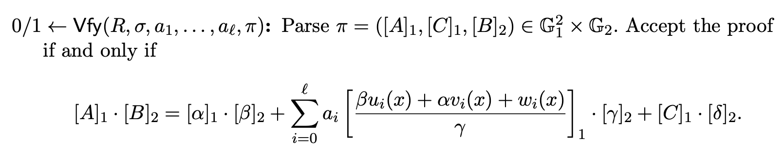

## ECPoint-operations-contracts


Elliptic curve point operations on solidity contract that:

1. leverages the pre-compiles : **add** and **multiplication** (EIP196) **paring** (EIP197) for Elliptic curve point

2. **Simple Verifier** in the form : $`\
0 = -A_1B_2 +\alpha_1\beta_2 + X_1\gamma_2 + C_1\delta_2\\X_1=x_1G1 + x_2G1 + x_3G1`$

Note that x1, x2, x3 are uint256 and the rest are G1 or G2 points when $`\
A_1, B_2, C_1, x_1,x_2,x_3`$ are arguments as public function

3. **Encrypted R1CS verifier** in the form : $`\
L\mathbf{\vec{[s]_1}}\odot R\mathbf{\vec{[s]_2}} = O\mathbf{\vec{[s]}_{12}}`$

4. **Groth16 verifier** with:
- Trusted Setup : 
- prover : 
- verifier : 


## Usage

### Build

```bash
forge build
```

### Test

#### Test Suites on Solidity Implementation

```bash
forge test -vvvv
```

#### Test Suites on Python Poc

```bash
poetry run pytest tests-python/test_add.py
```

```bash
poetry run pytest tests-python/test_matrix_mul.py
```

```bash
poetry run pytest tests-python/test_simple_verify.py
```

```bash
poetry run pytest tests-python/test_r1cs_verifier.py
```

> 💡 Note:

We use Python to generate the test cases and use relevant parameters(like EC points in Solidity test suites)

### Format

```bash
$ forge fmt
```